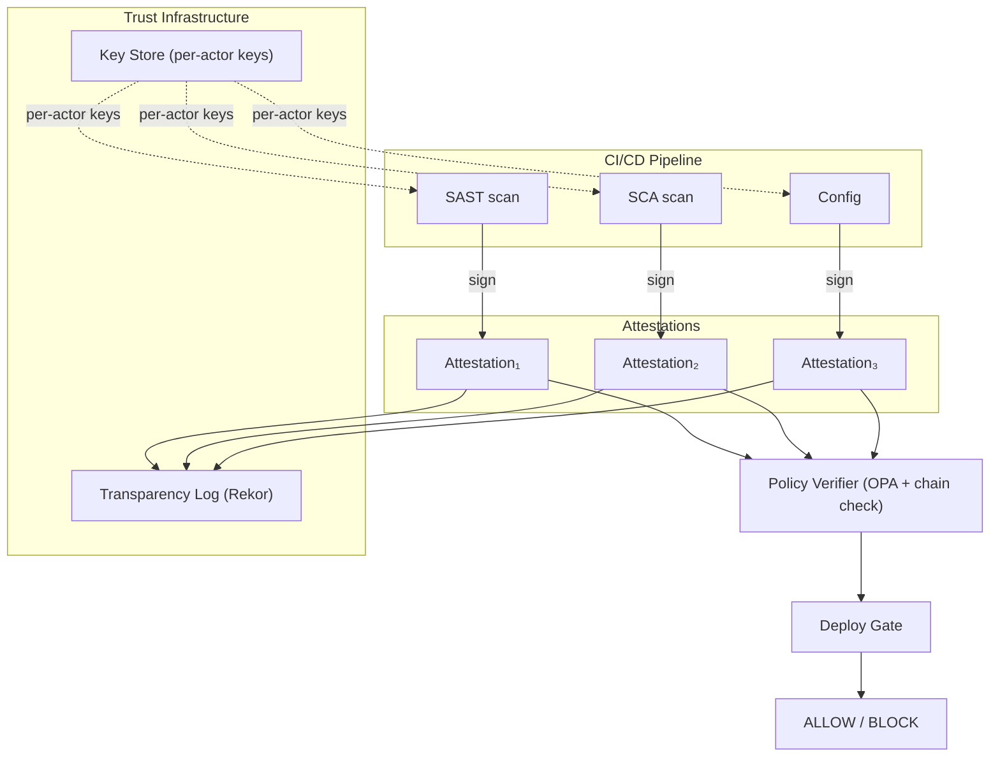
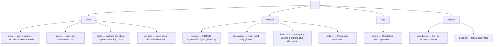

# DevSecOps Attestation

**MSc Thesis:** Cryptographically Verifiable Security Decisions in CI/CD-based DevSecOps Pipelines  
**Author:** Kovács Bálint-Hunor — Sapientia EMTE, Marosvásárhelyi Kar

---

## Architecture



Each attestation is an Ed25519-signed JSON envelope. Attestations are chained:
each one includes the SHA-256 digest of the previous, making insertion, deletion,
or reordering detectable.

---

## Project Structure



---

## Getting Started

### Generate a key pair

```bash
go run ./cmd/keygen --out keys/
# Writes keys/private.hex and keys/public.hex
# Store private.hex in GitHub Actions secrets as ATTESTATION_SIGNING_KEY
```

### Sign a security result manually

```bash
go run ./cmd/sign \
  --check-type sast \
  --tool semgrep \
  --result results/sast.json \
  --target-ref $(git rev-parse HEAD) \
  --subject myapp \
  --signing-key $(cat keys/private.hex) \
  --chain chain.json
```

### Verify and evaluate the gate

```bash
go run ./cmd/gate evaluate \
  --chain chain.json \
  --verify-signer $(cat keys/public.hex) \
  --policy .github/policies/deploy.rego
```

---

## Progressive Implementation Plan

### Phase 1 — Sign + Verify (MSc core)
- [x] `internal/crypto/signer.go` — Ed25519 sign, verify, digest
- [x] `cmd/sign` — CLI wrapper
- [x] `cmd/keygen` — key generation utility
- [x] Unit tests: tamper detection, key mismatch

### Phase 2 — Attestation Chains (MSc core)
- [x] `internal/attestation/chain.go` — chain building + verification
- [x] `cmd/verify` — CLI chain verifier
- [x] `cmd/gate` — deployment gate with OPA policy evaluation
- [x] Unit tests: all tamper attack vectors covered
- [ ] Integration test: full pipeline to chain to gate
- [ ] Transparency log submission (Rekor)

### Phase 3 — Threshold Signatures (MSc stretch / PhD seed)
- [x] `internal/threshold/threshold.go` — interfaces and types (stub)
- [ ] Simple t-of-n: collect t independent Ed25519 signatures
- [ ] FROST threshold scheme (proper single group signature)
- [ ] PhD: distribute over network with `GossipProtocol`

---

## PhD Extension Path

The crypto core of this project is designed as the foundation for a PhD
focusing on the **network layer** of distributed attestation:

| This MSc | PhD Extension |
|---|---|
| Local key pair per pipeline actor | Distributed key generation (DKG) |
| Chain as an ordered slice | Chain as a distributed DAG |
| Threshold signing (in-process) | BFT threshold signing over a network |
| Single verifier | Gossip-based attestation propagation |
| OPA policy engine | Distributed policy consensus |

The `threshold.GossipProtocol` interface in `internal/threshold/threshold.go`
is intentionally left as a stub — it marks exactly where the network layer
will plug in.

---

## Related Work

- [in-toto](https://in-toto.io/) — supply chain attestation framework
- [SLSA](https://slsa.dev/) — supply chain levels for software artifacts  
- [Sigstore/Cosign](https://docs.sigstore.dev/) — signing infrastructure
- [SPIFFE/SPIRE](https://spiffe.io/) — workload identity
- [FROST](https://eprint.iacr.org/2020/852.pdf) — threshold Schnorr signatures
