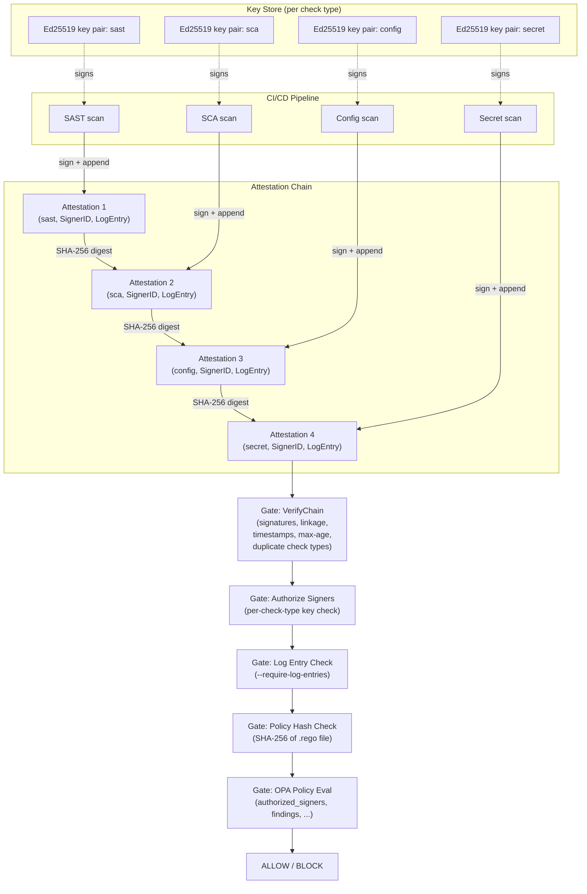

# Architecture

## System Design

> **Note:** `LogEntry` currently stores the GitHub Actions run URL as a transparency
> log reference. Submission to an external transparency log (e.g. Rekor/Sigstore) is
> a planned PhD-phase extension.

Each attestation is an Ed25519-signed JSON envelope. Attestations are chained:
each one includes the SHA-256 digest of the previous (including its signature),
making insertion, deletion, or reordering detectable.

## Data Flow

1. Each CI step runs a security tool and writes a JSON result file.
2. The `sign` binary wraps the result in a `types.Attestation`, sets `SignerID`
   and `LogEntry`, signs the canonical payload with the check-type-specific
   Ed25519 private key, links the attestation to the previous one via SHA-256
   digest, and appends it to `attestation-chain.json`.
3. The `gate evaluate` binary runs a sequence of checks in strict order before
   any policy evaluation:
   a. Load the chain from disk.
   b. `VerifyChainWithOptions` - verifies every Ed25519 signature, chain
      linkage (PreviousDigest), subject consistency, timestamp ordering,
      no future timestamps, optional max-age, and no duplicate check types.
   c. Signer authorization - verifies each attestation was signed by the
      key authorized for its check type (`--authorized-signers`) or that all
      attestations use a single shared key (`--verify-signer`).
   d. Log entry enforcement - if `--require-log-entries` is set, every
      attestation must carry a non-empty `LogEntry`.
   e. Policy file integrity - if `--policy-hash` is set, the SHA-256 of the
      Rego policy file is verified before it is loaded.
   f. OPA policy evaluation - the verified, authorized chain is evaluated
      against the Rego policy to produce an ALLOW or BLOCK decision.
4. If the policy allows, deployment proceeds. If blocked, the pipeline fails
   with human-readable denial reasons.

## Cryptographic Guarantees

- **Signature integrity**: each attestation's canonical payload is signed with
  Ed25519. The canonical payload includes `id`, `subject`, `result`,
  `timestamp`, `previous_digest`, and `signer_id`. Tampering with any of these
  fields invalidates the signature.
- **Signer identity binding**: `SignerID` (e.g. `github-runner:Linux`) is part
  of the canonical payload and therefore covered by the Ed25519 signature.
  Injecting or changing `SignerID` after signing is detectable.
- **LogEntry exclusion**: `LogEntry` is intentionally excluded from the
  canonical payload. It is a post-signing reference that does not affect the
  cryptographic proof. Its presence is enforced separately at the gate level.
- **Chain integrity**: each attestation includes the SHA-256 digest of the
  complete previous attestation (payload + signature + public key). Any
  insertion, deletion, or reordering is detectable.
- **Per-check-type key isolation**: each check type uses a dedicated key pair.
  A compromised key for one check type cannot be used to forge attestations for
  another. The gate's `--authorized-signers` flag enforces this at the Go level
  before policy evaluation.
- **Timestamp enforcement**: `VerifyChainWithOptions` rejects attestations with
  future timestamps (beyond a configurable clock skew tolerance, default 60 s),
  timestamps that regress relative to the previous attestation, and attestations
  older than the `--max-age` limit. This prevents timestamp manipulation and
  replay of stale chains.
- **Policy integrity**: `--policy-hash` pins the expected SHA-256 of the Rego
  policy file. A modified or substituted policy is rejected before OPA loads it.
- **Gate precondition**: the policy is never evaluated on an unverified or
  unauthorized chain. A chain that fails any of the earlier checks causes the
  gate to exit 1 without consulting OPA.
