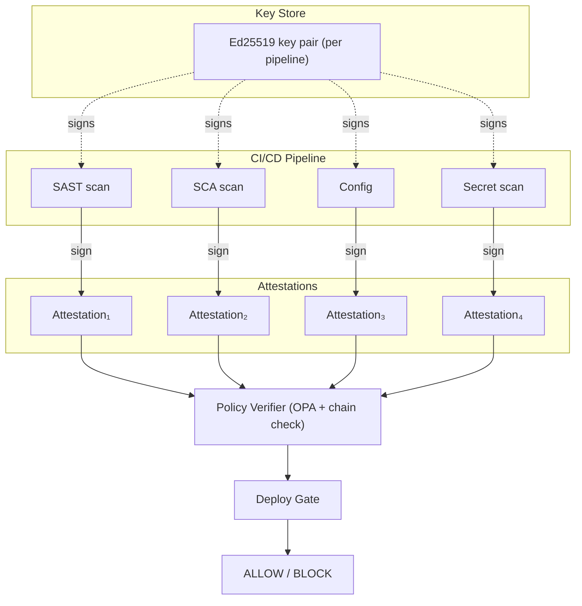

# Architecture

## System Design

> **Note:** Transparency log integration (Rekor/Sigstore) is a planned PhD-phase
> extension. The current implementation stores the attestation chain as a local JSON
> file uploaded as a GitHub Actions artifact.

Each attestation is an Ed25519-signed JSON envelope. Attestations are chained:
each one includes the SHA-256 digest of the previous, making insertion, deletion,
or reordering detectable.

## Data Flow

1. Each CI step (SAST, SCA, config scan) runs a security tool and writes a JSON result.
2. The `sign` binary wraps the result in a `types.Attestation`, signs it with Ed25519,
   links it to the previous attestation via SHA-256 digest, and appends it to
   `attestation-chain.json`.
3. The `gate evaluate` binary loads the chain, verifies all signatures and chain
   linkage, then evaluates the chain against a Rego policy via OPA.
4. If the policy allows, deployment proceeds. If blocked, the pipeline fails with reasons.

## Cryptographic Guarantees

- **Signature integrity**: each attestation's payload is signed with Ed25519 using the
  pipeline actor's private key. Tampering with any field invalidates the signature.
- **Chain integrity**: each attestation includes the SHA-256 digest of the previous
  attestation (including its signature), making insertion, deletion, or reordering
  detectable during chain verification.
- **Gate precondition**: the deployment gate always verifies the full chain before
  evaluating the policy. Policy evaluation on an unverified chain is a security defect.
