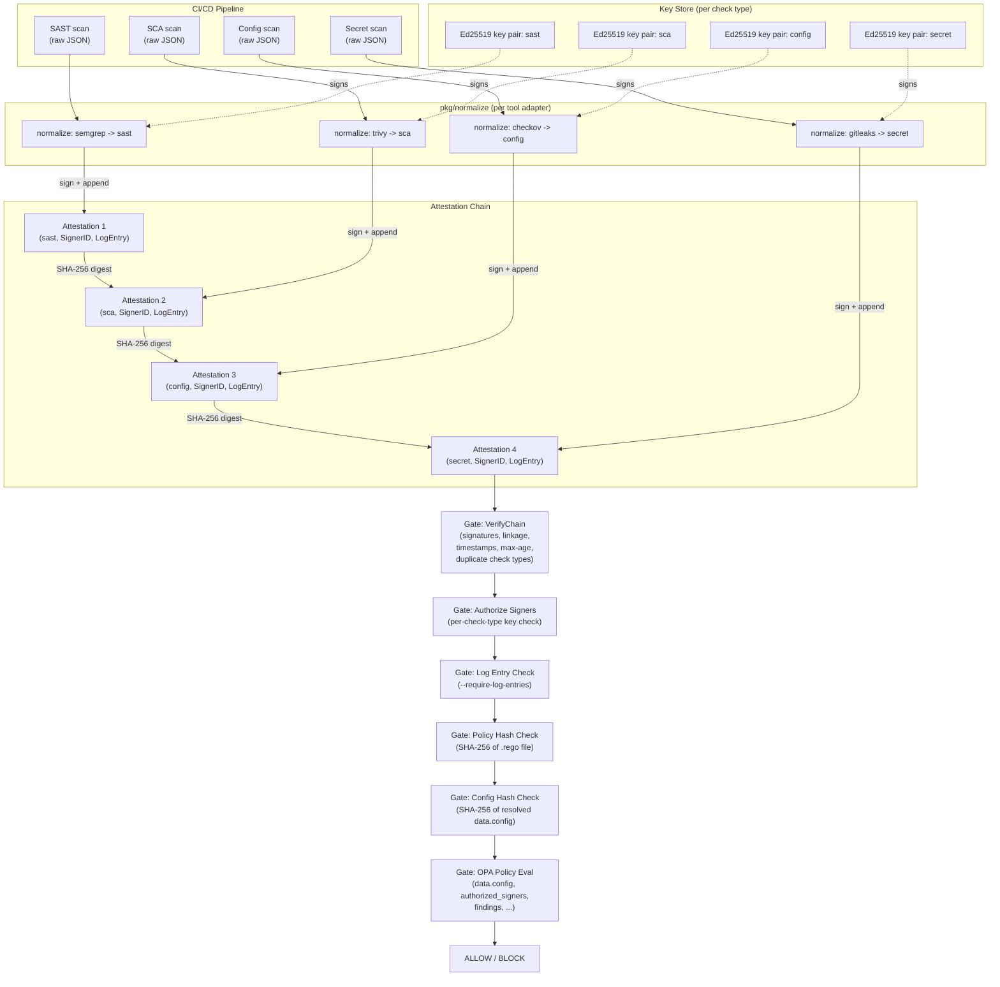

# Architecture

## System Design

```mermaid
flowchart TB
    subgraph CI["CI/CD Pipeline"]
        SAST["SAST scan\n(raw JSON)"]
        SCA["SCA scan\n(raw JSON)"]
        CFG["Config scan\n(raw JSON)"]
        SEC["Secret scan\n(raw JSON)"]
    end

    subgraph NORM["pkg/normalize (per tool adapter)"]
        N1["normalize: semgrep -> sast"]
        N2["normalize: trivy -> sca"]
        N3["normalize: checkov -> config"]
        N4["normalize: gitleaks -> secret"]
    end

    subgraph KS["Key Store (per check type)"]
        K1["Ed25519 key pair: sast"]
        K2["Ed25519 key pair: sca"]
        K3["Ed25519 key pair: config"]
        K4["Ed25519 key pair: secret"]
    end

    subgraph AT["Attestation Chain"]
        A1["Attestation 1\n(sast, SignerID, LogEntry)"]
        A2["Attestation 2\n(sca, SignerID, LogEntry)"]
        A3["Attestation 3\n(config, SignerID, LogEntry)"]
        A4["Attestation 4\n(secret, SignerID, LogEntry)"]
        A1 -->|SHA-256 digest| A2
        A2 -->|SHA-256 digest| A3
        A3 -->|SHA-256 digest| A4
    end

    SAST --> N1
    SCA --> N2
    CFG --> N3
    SEC --> N4

    K1 -.->|signs| N1
    K2 -.->|signs| N2
    K3 -.->|signs| N3
    K4 -.->|signs| N4

    N1 -->|sign + append| A1
    N2 -->|sign + append| A2
    N3 -->|sign + append| A3
    N4 -->|sign + append| A4

    A4 --> GV["Gate: VerifyChain\n(signatures, linkage,\ntimestamps, max-age,\nduplicate check types)"]
    GV --> GA["Gate: Authorize Signers\n(per-check-type key check)"]
    GA --> GL["Gate: Log Entry Check\n(--require-log-entries)"]
    GL --> GH["Gate: Policy Hash Check\n(SHA-256 of .rego file)"]
    GH --> GC["Gate: Config Hash Check\n(SHA-256 of resolved data.config)"]
    GC --> GP["Gate: OPA Policy Eval\n(data.config, authorized_signers,\nfindings, ...)"]
    GP --> OUT["ALLOW / BLOCK"]
```

> **Note:** `LogEntry` currently stores the GitHub Actions run URL as a transparency
> log reference. Submission to an external transparency log (e.g. Rekor/Sigstore) is
> a planned PhD-phase extension. `--require-log-entries` checks only that
> `LogEntry` is non-empty; it is excluded from the canonical payload, so it is a
> non-authenticated reference until inclusion proofs are verified (see SECURITY.md).

Each attestation is an Ed25519-signed JSON envelope. Attestations are chained:
each one includes the SHA-256 digest of the previous (including its signature),
making insertion, deletion, or reordering detectable.

## Data Flow

1. Each CI step runs a security tool and writes a raw JSON result file in
   that tool's own native format.
2. The `attest` binary (built from `cmd/sign`) normalizes the raw report
   through `pkg/normalize` when `--tool-format` (or `attest normalize`
   beforehand) selects an adapter, translating tool-specific findings and
   severities into the canonical `{ passed, findings }` shape. The
   normalized result is wrapped in a `types.Attestation`, `SignerID` and
   `LogEntry` are set, the canonical payload is signed with the
   check-type-specific Ed25519 private key, the attestation is linked to the
   previous one via SHA-256 digest, and it is appended to
   `attestation-chain.json`. Adapters fail closed: an unrecognized report
   format is rejected rather than normalized to zero findings.
3. The `gate evaluate` binary runs a sequence of checks in strict order before
   any policy evaluation:
   a. Load the chain from disk.
   b. `VerifyChainWithOptions` - verifies every Ed25519 signature, chain
      linkage (PreviousDigest), subject consistency, timestamp ordering,
      no future timestamps, optional max-age, and no duplicate check types.
   c. Signer authorization - verifies each attestation was signed by the
      key authorized for its check type (`--authorized-signers`) or that all
      attestations use a single shared key (`--verify-signer`).
   c.1. Commit binding - if `--target-ref` (and/or `--subject`) is set, every
      attestation's `result.target_ref` (and/or `subject.name`) must equal it.
   d. Log entry enforcement - if `--require-log-entries` is set, every
      attestation must carry a non-empty `LogEntry` (presence only).
   e. Policy file integrity - if `--policy-hash` is set, the SHA-256 of the
      Rego policy source (the file at `--policy`, or the embedded canonical
      policy when omitted) is verified before it is loaded.
   f. Policy configuration integrity - if `--policy-hash` is set and the
      effective `data.config` (`required_checks`, `fail_on_severity`,
      `zero_tolerance_checks`, defaults filled in) is not the bundled
      policy's defaults, `--config-hash` must match its SHA-256, computed
      with `gate config-hash`.
   g. OPA policy evaluation - the verified, authorized chain is evaluated
      against the Rego policy, parameterized by `data.config`, to produce an
      ALLOW or BLOCK decision.
4. If the policy allows, deployment proceeds. If blocked, the pipeline fails
   with human-readable denial reasons.

## Distribution and Composite Actions

The four CLI binaries and the canonical `policies/deploy.rego` are packaged
three ways so a consumer never needs to clone or build this repository:

- **Composite GitHub/Forgejo Actions** (`actions/setup`, `actions/normalize-sign`,
  `actions/gate`) - bash-only composite actions (no Node.js runtime
  dependency) that wrap the CLI binaries and produce a `GateDecision` report
  plus a markdown job summary. Each action's logic lives in a shellcheck-able
  script (`setup.sh`, `normalize-sign.sh`, `gate.sh`), not inline YAML.
- **Container image** - `ghcr.io/memergamer/devsecops-attestation:<version>`,
  a distroless non-root image bundling all four binaries and the default
  policy, invoked as `docker run -v $PWD:/work IMAGE <binary> ...`.
- **GoReleaser archives** - per-OS/arch `.tar.gz`/`.zip` archives with a
  `checksums.txt` and cosign signature, published to the GitHub release that
  `release-please` creates for each tag.

See [`docs/integration-guide.md`](integration-guide.md) for the full
consumer-facing walkthrough of installation, key provisioning, and workflow
wiring.

## Cryptographic Guarantees

- **Signature integrity**: each attestation's canonical payload is signed with
  Ed25519. The canonical payload includes `id`, `subject`, `result`,
  `timestamp`, `previous_digest`, and `signer_id`. Tampering with any of these
  fields invalidates the signature.
- **Signer identity binding**: `SignerID` (e.g. `github-runner:Linux`) is part
  of the canonical payload and therefore covered by the Ed25519 signature.
  Injecting or changing `SignerID` after signing is detectable.
- **LogEntry exclusion**: `LogEntry` is intentionally excluded from the
  canonical payload. It is a post-signing reference that does not affect the
  cryptographic proof. Its presence is enforced separately at the gate level.
- **Chain integrity**: each attestation includes the SHA-256 digest of the
  complete previous attestation (payload + signature + public key). Any
  insertion, deletion, or reordering is detectable.
- **Per-check-type key isolation**: each check type uses a dedicated key pair.
  A compromised key for one check type cannot be used to forge attestations for
  another. The gate's `--authorized-signers` flag enforces this at the Go level
  before policy evaluation.
- **Timestamp enforcement**: `VerifyChainWithOptions` rejects attestations with
  future timestamps (beyond a configurable clock skew tolerance, default 60 s),
  timestamps that regress relative to the previous attestation, and attestations
  older than the `--max-age` limit. This prevents timestamp manipulation and
  replay of stale chains.
- **Policy integrity**: `--policy-hash` pins the expected SHA-256 of the Rego
  policy source. A modified or substituted policy is rejected before OPA loads
  it. `internal/policy` embeds the canonical `policies/deploy.rego` as the
  default so there is exactly one copy of the policy logic to audit; `gate
  policy-hash` (with no `--policy`) hashes this embedded copy.
- **Policy configuration integrity**: `--config-hash` pins the expected
  SHA-256 of the fully resolved `data.config` (defaults filled in), a
  separate trust boundary from `--policy-hash`. Pinning the policy's logic
  while leaving a non-default configuration unpinned would let a change to
  the gate invocation - not the policy file - silently change what is
  allowed. `gate config-hash` computes the value to pin.
- **Gate precondition**: the policy is never evaluated on an unverified or
  unauthorized chain. A chain that fails any of the earlier checks causes the
  gate to exit 1 without consulting OPA.
- **Normalization fail-closed**: `pkg/normalize` adapters require a schema
  marker unique to their tool's native report format and reject input that
  lacks it, rather than silently normalizing to zero findings. This prevents
  a misconfigured `--tool-format` or a crashed scanner from being signed as a
  clean scan.
