# Project Structure

## Directory Layout

```mermaid
flowchart TB
    R["."]
    CMD["cmd/"]
    INT["internal/"]
    PKG["pkg/"]
    GH[".github/"]
    DOCS["docs/"]

    R --> CMD
    R --> INT
    R --> PKG
    R --> GH
    R --> DOCS

    CMD --> CS["sign/ -- sign a security check result into the chain"]
    CMD --> CV["verify/ -- verify an attestation chain"]
    CMD --> CG["gate/ -- evaluate the chain against a deploy policy"]
    CMD --> CK["keygen/ -- generate an Ed25519 key pair"]

    INT --> IC["crypto/ -- Ed25519 sign/verify, digest, canonical payload"]
    INT --> IA["attestation/ -- chain build, verify, VerifyChainWithOptions"]
    INT --> IT["threshold/ -- multi-party threshold signing"]
    INT --> IP["policy/ -- OPA policy evaluation"]

    PKG --> PT["types/ -- Attestation, SecurityResult, PolicyInput, ..."]

    GH --> GW["workflows/ -- GitHub Actions pipeline"]
    GH --> GP["policies/ -- Rego policy files"]

    R --> TEST["test/"]
    TEST --> TI["integration/ -- end-to-end pipeline tests (build tag: integration)"]
```

## Package Responsibilities

| Package | Path | Responsibility |
|---------|------|----------------|
| `types` | `pkg/types/` | Core data structures shared across all packages |
| `crypto` | `internal/crypto/` | Ed25519 key generation, signing, verification, SHA-256 digest, canonical payload |
| `attestation` | `internal/attestation/` | Chain building (`Chain.Add`) and verification (`VerifyChain`, `VerifyChainWithOptions`) |
| `policy` | `internal/policy/` | OPA/Rego policy evaluation, `EvaluateFromFile`, `DefaultPolicy` |
| `threshold` | `internal/threshold/` | t-of-n multisig interfaces; `SimpleParticipant` / `SimpleAggregator` (Ed25519); `VerifyThreshold` |
| `integration` | `test/integration/` | End-to-end pipeline tests, run with `-tags integration` |

## CLI Binaries

| Binary | Package | Purpose |
|--------|---------|---------|
| `keygen` | `cmd/keygen/` | Generate an Ed25519 key pair, write `private.hex` and `public.hex` |
| `attest` | `cmd/sign/` | Sign a scan result and append it to the attestation chain |
| `verify` | `cmd/verify/` | Load and verify all signatures, chain linkage, and timestamps |
| `gate` | `cmd/gate/` | Verify chain, authorize signers, enforce log entries, check policy hash, evaluate OPA policy |

## `cmd/sign` Flags

| Flag | Required | Description |
|------|----------|-------------|
| `--check-type` | yes | `sast`, `sca`, `config`, or `secret` |
| `--tool` | yes | Tool name (e.g. `semgrep`) |
| `--result` | yes | Path to JSON scan result file |
| `--target-ref` | yes | Git SHA or artifact digest |
| `--subject` | yes | Application or artifact name |
| `--signing-key` | yes | 128-char hex Ed25519 private key |
| `--signer-id` | no | Human-readable signer identity (covered by signature) |
| `--log-entry` | no | Transparency log URL or reference (stored after signing) |
| `--chain` | no | Path to chain file (default: `attestation-chain.json`) |
| `--out` | no | Write output to a different path instead of `--chain` |

## `cmd/gate evaluate` Flags

| Flag | Required | Description |
|------|----------|-------------|
| `--chain` | yes | Path to chain JSON file |
| `--verify-signer` | see note | Hex public key; all attestations must use this key |
| `--authorized-signers` | see note | `check_type=hex` pairs (e.g. `sast=<hex>,sca=<hex>`); enforced per check type |
| `--policy` | no | Path to Rego policy file (uses built-in policy if omitted) |
| `--policy-hash` | no | Expected SHA-256 hex of the policy file; requires `--policy` |
| `--max-age` | no | Maximum allowed attestation age (e.g. `24h`) |
| `--require-log-entries` | no | Fail if any attestation lacks a `log_entry` field |
| `--output` | no | Write `GateDecision` JSON to this path |

**Note:** exactly one of `--verify-signer` or `--authorized-signers` must be provided.
`--authorized-signers` enables per-check-type key isolation and is the recommended
production configuration.

## Key Design Decisions

- `canonicalPayload` in `internal/crypto` excludes `Signature` and `SignerPublicKey`
  so these fields can be set after signing without invalidating the signature.
  `SignerID` is included in the canonical payload so signer identity is
  cryptographically bound. `LogEntry` is excluded because it is a post-signing
  reference, not part of the security proof.
- `Digest` covers the full attestation including its signature, so the chain link
  depends on the cryptographic proof as well as the payload.
- `VerifyChainWithOptions` runs seven checks in sequence: Ed25519 signature,
  chain linkage, subject consistency, no future timestamps, monotonic timestamps,
  max-age, and no duplicate check types. All checks run before any policy evaluation.
- The `Chain` type uses a "one-shot" pattern for `SetNextSignerID` and
  `SetNextLogEntry`: the value is consumed by the next `Add` call and then reset
  to `""`, so subsequent calls are unaffected.
- The `threshold` package calls `crypto.CanonicalPayload` directly so all
  participants sign the same bytes without duplicating the canonical JSON logic.
- `toMap` in `internal/policy` injects `signer_public_key_hex` into each
  attestation before passing input to OPA. JSON marshaling encodes `[]byte` as
  base64, but policy authors work with hex strings, so the conversion is done
  transparently.
