# Project Structure

## Directory Layout

```mermaid
flowchart TB
    R["."]
    CMD["cmd/"]
    INT["internal/"]
    PKG["pkg/"]
    GH[".github/"]
    DOCS["docs/"]

    R --> CMD
    R --> INT
    R --> PKG
    R --> GH
    R --> DOCS

    CMD --> CS["sign/ — sign a security check result into the chain"]
    CMD --> CV["verify/ — verify an attestation chain"]
    CMD --> CG["gate/ — evaluate the chain against a deploy policy"]
    CMD --> CK["keygen/ — generate an Ed25519 key pair"]

    INT --> IC["crypto/ — Ed25519 sign/verify, digest"]
    INT --> IA["attestation/ — chain build + verify"]
    INT --> IT["threshold/ — multi-party threshold signing"]
    INT --> IP["policy/ — OPA policy evaluation"]

    PKG --> PT["types/ — Attestation, SecurityResult, ..."]

    GH --> GW["workflows/ — GitHub Actions pipeline"]
    GH --> GP["policies/ — Rego policy files"]

    R --> TEST["test/"]
    TEST --> TI["integration/ — end-to-end pipeline tests (build tag: integration)"]
```

## Package Responsibilities

| Package | Path | Responsibility |
|---------|------|----------------|
| `types` | `pkg/types/` | Core data structures shared across all packages |
| `crypto` | `internal/crypto/` | Ed25519 key generation, signing, verification, SHA-256 digest |
| `attestation` | `internal/attestation/` | Chain building (`Chain.Add`) and verification (`VerifyChain`) |
| `policy` | `internal/policy/` | OPA/Rego policy evaluation and `EvaluateFromFile` |
| `threshold` | `internal/threshold/` | t-of-n multisig interfaces; `SimpleParticipant` / `SimpleAggregator` (Ed25519); `VerifyThreshold` |
| `integration` | `test/integration/` | End-to-end pipeline tests, run with `-tags integration` |

## CLI Binaries

| Binary | Package | Purpose |
|--------|---------|---------|
| `keygen` | `cmd/keygen/` | Generate an Ed25519 key pair, write `private.hex` and `public.hex` |
| `attest` | `cmd/sign/` | Sign a scan result and append it to the attestation chain |
| `verify` | `cmd/verify/` | Load and verify all signatures and chain linkage |
| `gate` | `cmd/gate/` | Verify the chain, then evaluate it against a deploy policy |

## Key Design Decisions

- `canonicalPayload` in `internal/crypto` excludes `Signature` and `SignerPublicKey` so
  these fields can be set after signing without invalidating the signature.
- `Digest` covers the full attestation including its signature, so the chain link
  depends on the cryptographic proof as well as the payload.
- The `threshold` package calls `crypto.CanonicalPayload` directly so all participants
  sign the same bytes without duplicating the canonical JSON logic.
