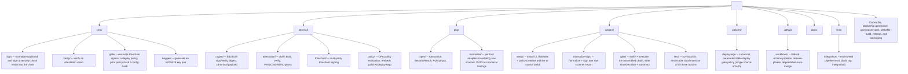

# Project Structure

## Directory Layout

```mermaid
flowchart TB
    R["."]
    CMD["cmd/"]
    INT["internal/"]
    PKG["pkg/"]
    ACT["actions/"]
    POL["policies/"]
    GH[".github/"]
    DOCS["docs/"]

    R --> CMD
    R --> INT
    R --> PKG
    R --> ACT
    R --> POL
    R --> GH
    R --> DOCS

    CMD --> CS["sign/ -- normalize (optional) and sign a security check result into the chain"]
    CMD --> CV["verify/ -- verify an attestation chain"]
    CMD --> CG["gate/ -- evaluate the chain against a deploy policy, print policy-hash / config-hash"]
    CMD --> CK["keygen/ -- generate an Ed25519 key pair"]

    INT --> IC["crypto/ -- Ed25519 sign/verify, digest, canonical payload"]
    INT --> IA["attestation/ -- chain build, verify, VerifyChainWithOptions"]
    INT --> IT["threshold/ -- multi-party threshold signing"]
    INT --> IP["policy/ -- OPA policy evaluation, embeds policies/deploy.rego"]

    PKG --> PT["types/ -- Attestation, SecurityResult, PolicyInput, ..."]
    PKG --> PN["normalize/ -- per-tool adapters translating raw scanner JSON to canonical findings"]

    ACT --> AS["setup/ -- install CLI binaries + policy (release archive or source build)"]
    ACT --> AN["normalize-sign/ -- normalize + sign one raw scanner report"]
    ACT --> AG["gate/ -- verify + evaluate the assembled chain, write GateDecision + summary"]
    ACT --> AT["test/ -- run-local.sh: rerunnable local exercise of all three actions"]

    POL --> PD["deploy.rego -- canonical, parameterizable deploy gate policy (single source of truth)"]

    GH --> GW["workflows/ -- GitHub Actions pipeline, release-please, dependabot-auto-merge"]

    R --> TEST["test/"]
    TEST --> TI["integration/ -- end-to-end pipeline tests (build tag: integration)"]

    R --> BUILD["Dockerfile, Dockerfile.goreleaser, .goreleaser.yaml, Makefile -- build, release, and packaging"]
```

## Package Responsibilities

| Package | Path | Responsibility |
|---------|------|----------------|
| `types` | `pkg/types/` | Core data structures shared across all packages |
| `normalize` | `pkg/normalize/` | Per-tool adapters (semgrep, trivy, checkov, gitleaks, cargo-audit, mix_audit, sobelow, generic) translating raw scanner JSON into canonical `{ passed, findings }`; fail closed on unrecognized input |
| `crypto` | `internal/crypto/` | Ed25519 key generation, signing, verification, SHA-256 digest, canonical payload |
| `attestation` | `internal/attestation/` | Chain building (`Chain.Add`) and verification (`VerifyChain`, `VerifyChainWithOptions`) |
| `policy` | `internal/policy/` | OPA/Rego policy evaluation, `EvaluateFromFile`, `DefaultPolicy` (embeds `policies/deploy.rego`) |
| `threshold` | `internal/threshold/` | t-of-n multisig interfaces; `SimpleParticipant` / `SimpleAggregator` (Ed25519); `VerifyThreshold` |
| `integration` | `test/integration/` | End-to-end pipeline tests, run with `-tags integration` |

## `policies/` and `actions/`

| Path | Responsibility |
|------|-----------------|
| `policies/deploy.rego` | Canonical, parameterizable deploy gate policy; single source of truth embedded by `internal/policy` and referenced directly by CI |
| `actions/setup/` | Composite action: installs the CLI binaries and bundled policy from a release archive or a source build |
| `actions/normalize-sign/` | Composite action: runs `attest normalize` and `attest sign --tool-format` for one raw scanner report |
| `actions/gate/` | Composite action: runs `verify` then `gate evaluate`, writes the `GateDecision` report and a job summary |
| `actions/test/run-local.sh` | Rerunnable local exercise of all three actions (build, sign, verify, gate, shellcheck, `action.yml` validation), without a real runner |

## CLI Binaries

| Binary | Package | Purpose |
|--------|---------|---------|
| `keygen` | `cmd/keygen/` | Generate an Ed25519 key pair, write `private.hex` and `public.hex` |
| `attest` | `cmd/sign/` | Sign a scan result and append it to the attestation chain |
| `verify` | `cmd/verify/` | Load and verify all signatures, chain linkage, and timestamps |
| `gate` | `cmd/gate/` | Verify chain, authorize signers, enforce log entries, check policy hash, evaluate OPA policy |

`attest` has three subcommands: `sign` (also the root command's default
behavior), `normalize`, and `tools`.

## `cmd/sign` (`attest sign`) Flags

| Flag | Required | Description |
|------|----------|-------------|
| `--check-type` | see note | `sast`, `sca`, `config`, `secret`, or a custom `^[a-z][a-z0-9-]{0,31}$` identifier |
| `--tool` | see note | Tool name (e.g. `semgrep`) |
| `--tool-format` | no | Normalize adapter name; when set, `--result` is treated as a raw tool report and normalized inline before signing, and supplies default `--check-type`/`--tool` values |
| `--result` | yes | Path to JSON scan result file (raw, when `--tool-format` is set; canonical otherwise) |
| `--target-ref` | yes | Git SHA or artifact digest |
| `--subject` | yes | Application or artifact name |
| `--signing-key-file` | see note | Path to a file containing the 128-char hex Ed25519 private key (whitespace trimmed); preferred over `--signing-key` |
| `--signing-key` | see note | 128-char hex Ed25519 private key, passed on argv; discouraged (visible in `/proc/<pid>/cmdline`), kept for backward compatibility |
| `--fail-on` | no | Minimum severity (inclusive) that fails inline normalization, used with `--tool-format` (default `high`) |
| `--signer-id` | no | Human-readable signer identity (covered by signature); derived from CI env vars when omitted |
| `--log-entry` | no | Transparency log URL or reference (stored after signing); derived from CI env vars when omitted |
| `--no-env-defaults` | no | Disable deriving `--signer-id` / `--log-entry` from CI environment variables |
| `--chain` | no | Path to chain file (default: `attestation-chain.json`) |
| `--out` | no | Write output to a different path instead of `--chain` |

**Note:** `--check-type` and `--tool` are required unless `--tool-format`
supplies a default for them.

**Note:** exactly one signing key source must be provided: `--signing-key`,
`--signing-key-file`, or the `ATTEST_SIGNING_KEY` environment variable
(checked in that order; providing both `--signing-key` and
`--signing-key-file` is an error). Prefer `--signing-key-file` or
`ATTEST_SIGNING_KEY` in CI - a value on argv is visible to any process that
can read `/proc/<pid>/cmdline` for the life of the `attest` process, which
matters on shared runners.

## `cmd/sign normalize` (`attest normalize`) Flags

| Flag | Required | Description |
|------|----------|-------------|
| `--tool` | yes | Normalize adapter name, e.g. `semgrep` |
| `--in` | yes | Path to raw tool report, or `-` for stdin |
| `--fail-on` | no | Minimum severity (inclusive) that fails the run (default `high`) |
| `--out` | no | Write canonical JSON to this path instead of stdout |

## `cmd/gate evaluate` Flags

| Flag | Required | Description |
|------|----------|-------------|
| `--chain` | yes | Path to chain JSON file |
| `--verify-signer` | see note | Hex public key; all attestations must use this key |
| `--authorized-signers` | see note | `check_type=hex` pairs (e.g. `sast=<hex>,sca=<hex>`); enforced per check type |
| `--policy` | no | Path to Rego policy file (uses built-in policy if omitted) |
| `--policy-hash` | no | Expected SHA-256 hex of the policy source; verified against `--policy` or the embedded default |
| `--data` | no | Path to a JSON file whose object becomes `data.config`; validated fail-closed |
| `--required-checks` | no | Comma-separated required check types; overrides `data.config.required_checks` |
| `--fail-on-severity` | no | Minimum blocking severity: `info`\|`low`\|`medium`\|`high`\|`critical`; overrides `data.config.fail_on_severity` |
| `--zero-tolerance-checks` | no | Comma-separated check types with zero finding tolerance; overrides `data.config.zero_tolerance_checks` |
| `--config-hash` | no | Expected SHA-256 hex of the fully resolved `data.config`; required whenever `--policy-hash` is set and the effective config is non-default |
| `--max-age` | no | Maximum allowed attestation age (e.g. `24h`) |
| `--require-log-entries` | no | Fail if any attestation lacks a `log_entry` field (presence only; see SECURITY.md) |
| `--target-ref` | no | Every attestation's `result.target_ref` must equal this value (commit binding) |
| `--subject` | no | Every attestation's `subject.name` must equal this value |
| `--output` | no | Write `GateDecision` JSON to this path |

**Note:** exactly one of `--verify-signer` or `--authorized-signers` must be provided.
`--authorized-signers` enables per-check-type key isolation and is the recommended
production configuration.

## `cmd/gate policy-hash` / `cmd/gate config-hash`

`gate policy-hash [--policy <path>]` prints the SHA-256 hex of a Rego policy
file, or of the embedded default policy when `--policy` is omitted.
`gate config-hash [--data <path>] [--required-checks ...] [--fail-on-severity ...]
[--zero-tolerance-checks ...]` prints the SHA-256 hex of the effective
`data.config` for the given overrides, defaults filled in explicitly. Both
values are what `gate evaluate --policy-hash` / `--config-hash` pin.

## Key Design Decisions

- `canonicalPayload` in `internal/crypto` excludes `Signature` and `SignerPublicKey`
  so these fields can be set after signing without invalidating the signature.
  `SignerID` is included in the canonical payload so signer identity is
  cryptographically bound. `LogEntry` is excluded because it is a post-signing
  reference, not part of the security proof.
- `Digest` covers the full attestation including its signature, so the chain link
  depends on the cryptographic proof as well as the payload.
- `VerifyChainWithOptions` runs eight checks in sequence: Ed25519 signature,
  chain linkage, subject consistency, target-ref consistency, no future timestamps,
  monotonic timestamps, max-age, and no duplicate check types. All checks run
  before any policy evaluation.
- `log_entry` is a non-authenticated reference: `--require-log-entries` only
  checks that it is non-empty, and `LogEntry` is excluded from the canonical
  payload, so it carries no cryptographic binding to the attestation. `SignerID`
  is signed but not policy-checked; signer authorization is enforced through the
  signing key, not this string. See SECURITY.md for both.
- The `Chain` type uses a "one-shot" pattern for `SetNextSignerID` and
  `SetNextLogEntry`: the value is consumed by the next `Add` call and then reset
  to `""`, so subsequent calls are unaffected.
- The `threshold` package calls `crypto.CanonicalPayload` directly so all
  participants sign the same bytes without duplicating the canonical JSON logic.
- `toMap` in `internal/policy` injects `signer_public_key_hex` into each
  attestation before passing input to OPA. JSON marshaling encodes `[]byte` as
  base64, but policy authors work with hex strings, so the conversion is done
  transparently.
- `pkg/normalize` adapters fail closed on an unrecognized report: each
  requires a schema marker unique to its tool's native format and rejects
  input that lacks it, rather than silently normalizing to zero findings.
- Policy configuration (`data.config`) is validated fail-closed in two
  places: the gate CLI rejects a malformed `--data` file before it reaches
  OPA, and the bundled policy's own `config_valid` rule denies deployment
  for any malformed override that reaches OPA by another path.
- `--policy-hash` pins the policy's logic (the Rego source); `--config-hash`
  pins its parameters (the resolved `data.config`). These are separate trust
  boundaries: `--config-hash` is required whenever `--policy-hash` is set and
  the effective configuration is not the bundled defaults.
- `attest sign --fail-on` and `attest normalize --fail-on` default to
  `high`, matching the gate's default `--fail-on-severity`, so the
  signer-side pass determination and the gate-side blocking decision agree
  unless an operator deliberately diverges them.
- The composite actions under `actions/` are bash-only (`shell: bash`, no
  Node.js), so they run unmodified on both GitHub Actions and Forgejo
  Actions runners.
